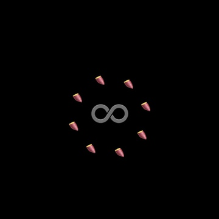

# EMO8

[](https://travis-ci.org/opyapeus/purescript-emo8)

絵文字のゲームが作れる関数型2Dゲームエンジン。

※まだBeta版です。

[ [English](README.md) ]




## こんな人にどうぞ

- 関数型言語で簡単なゲームを作りたい
- ゲーム素材を用意するのが面倒くさい
- 作ったゲームを楽に配布したい
- *purescriptを学ぶとっかかりが欲しい*

### なぜPureScript？

表現力が高く見通しの良いプログラムが書ける関数型言語だからです。
また、JavaScriptにコンパイルされて配布が容易だからです。

|            | 言語の表現力        | 配布の容易さ                  |
| ---------- | ------------------- | ----------------------------- |
| Haskell    | ○                   | △（JavaScriptへの変換が困難） |
| Elm        | △（型クラスがない） | ○                             |
| PureScript | ○                   | ○                             |

### なぜ絵文字？

Web上で誰でも気軽に使える素材だからです。
また、素材が限られていることでLEGOブロックで遊ぶように想像力をかき立てると思うからです。

また、このライブラリは[PICO-8](https://www.lexaloffle.com/pico-8.php)からインスピレーションを受けて作られています。
PICO-8も厳しい制約がありますが、それがゲーム作りを楽しくするものと思います。

## 今すぐ遊ぶ

サンプルプログラムをオンラインでプレイできます。

- [EMO8 GAMES](https://opyapeus.github.io/emo8/index.html)

## スペック

- 画面: 可変サイズ（目安 256px~1024px）
- 背景色: HTML名前付きカラー 140色
- 絵文字: Unicode絵文字 - [Supported Emojis](docs/emoji.md)
- 入力: 8ボタン（上下左右4ボタンx2）
- マップ: 制限なし 絵文字のマップ - [Map Edit](docs/usage.md#map-edit)
- サウンド: 4チャンネル 絵文字の楽譜 - [Sound Edit](docs/usage.md#sound-edit)
- 言語: [PureScript](http://www.purescript.org/)
- コンパイル後容量: 目安 500KB~1MB
- フレームレート: 約60FPS
- 動作環境: Webブラウザ

## コントローラー

- キーボード

```
 /¯¯¯\_/¯¯¯\
|  W  |  ↑  |
| A D | ← → |
|  S  |  ↓  |
 \___/¯\___/
```

- タッチパネル（スワイプ）

```
|¯¯¯¯¯¯¯¯|¯¯¯¯¯¯¯¯|
|   👆    |   👆   |
| 👈   👉 | 👈   👉 |
|   👇    |   👇   |
|________|________|
```

## サンプルプログラム

最初にリポジトリをクローンします。
yarnが必要です。

### インストール

```sh
yarn
yarn postinstall
```

### ビルド

```sh
yarn build
yarn example
```

### 起動（htmlをブラウザで開く）

```sh
open dist/hello/index.html
open dist/basic/index.html
open dist/emodius/index.html
open dist/nekof/index.html
```

## 簡易マニュアル（英語）

- [Usage](docs/usage.md)

## 便利なゲーム開発用テンプレート

- [EMO8 Builder](https://github.com/opyapeus/emo8-builder)

## APIドキュメント

- [Module documentation on Pursuit](https://pursuit.purescript.org/packages/purescript-emo8/)

## 開発中

- [ ] Web上でオンライン実行できる環境
- [ ] パフォーマンスの改善

## 様子見中

- canvasの絵文字の回転 (45°, 135°, 225°, 315°) 表示の問題 [Why won't emojis render when rotated to 45 (or 315) degrees?](https://stackoverflow.com/questions/39749540/why-wont-emojis-render-when-rotated-to-45-or-315-degrees)
- 絵文字のデフォルト表示形式 [CSS Fonts Module Level 4 - Editor’s Draft, 17 August 2018](https://drafts.csswg.org/css-fonts-4/#font-variant-emoji-prop)

## コントリビューション

まだBeta版なのでお待ちください。
もし改善点を見つけたらissueをください。
ありがとうございます。

## ライセンス

[MIT](LICENSE)
