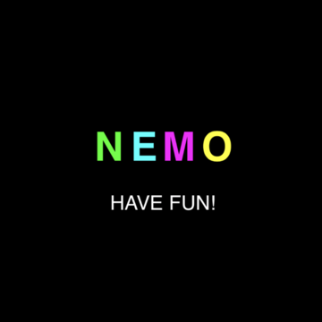

# NEMO

[ [日本語](README.ja.md) ]

※ it's beta for now

A functional game engine for creating emoji games.




## Major Features

- Easy to create games with powerful functional languages ​​(PureScript).
- Only emojis can be used as materials. Instead, there is room for creativity.
- JavaScript knowledge is basically unnecessary. You can concentrate on implementing game logic with functional languages.
- You can play on any device on which the browser runs.

### Why PureScript

When making games in functional language, there were the following options.

Haskell ->
If everything could be done with this, it was the best.
However, it is difficult to play on any device.

Elm ->
It was one of the good options when thinking about device independence.
But there is no type class support.
It is also recommended that you follow the Elm architecture.

PureScript ->
There is type class support like Haskell.
It will also be compiled into Javascript.
Therefore, you can play on any device browser!

### Why Only Emojis

Something restricted stimulates creativity.

I was very inspired by fantasy consoles represented by [PICO-8](https://www.lexaloffle.com/pico-8.php).

There are severe restrictions on sprites, sounds, capacity, etc. that can be used.

On the contrary, These constraints inspire creativity and making the game more fun.

Just like this, I think that it is very interesting to have constraints that only emojis can be used in the Web platform.

## Play Online

- [NEMO GAMES](https://opyapeus.github.io/nemo/index.html)

You can also add games you made with NEMO here.

If you want, please make issue or PR at Github Pages [Repository](https://github.com/opyapeus/nemo)

## Installation

```sh
bower i purescript-nemo
```

## Getting Started

- [Usage](docs/usage.md)

## Specification

- Language: PureScript
- Monitor Size: 1024x1024
- Emoji: 1388 unicode emojis
- Color: 16 html base colors
- Map Editor: Raw text (emoji) editing
- Sound Editor: Raw text (emoji) editing
- Input Interface: Keyboard, Touch Screen
- Frame Rate: About 60 FPS
- Working Environment: Browers on any device (It needs some GPU power)

## Input Interface

### Keyboard

```plain
 /¯¯¯\_/¯¯¯\
|  W  |  ↑  |
| A D | ← → |
|  S  |  ↓  |
 \___/¯\___/
 ```

### Touch Screen

For mobile, it is equivalent to keyboard inputs that swiping on the right or left side of the screen.

※ The swipe origin is the touch position which started.

## Examples

clone this repository first.

install

```sh
npm i
bower i
```

build

※ if you can not build with warning, please ```pulp build``` once.

```sh
npm run build
npm run build:examples
```

open html (public folder) on browser

```sh
npm run open
```

access with tag (it may need reload)

```url
public/index.html#hello
public/index.html#basic
public/index.html#emodius
```

## Emojis

- [Supported Emojis](docs/emoji.md)

## Under Developing List

- [ ] interpreter which executes code on the web
- [ ] performance tuning
- [ ] iOS sound support

## Wait And See

- emoji rotate (45°, 135°, 225°, 315°) problem on canvas
- default emoji presentation [CSS Fonts Module Level 4 - Editor’s Draft, 17 August 2018](https://drafts.csswg.org/css-fonts-4/#font-variant-emoji-prop)

## Module Documentation

- [Module documentation on Pursuit](https://pursuit.purescript.org/packages/purescript-nemo/)

## Contribution

Since it is beta version, wait for a while.
If you find an improvement point, please give me an issue.
Thank you.

## License

[MIT](LICENSE)

※ About license of emojis' graphics are owned by each vendor.