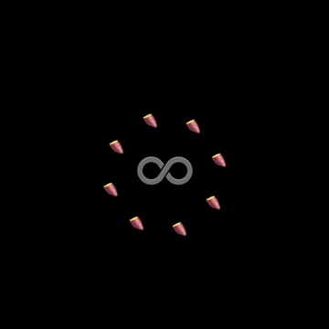

# EMO8

[](https://travis-ci.org/opyapeus/purescript-emo8)

A functional 2D game engine that can create emoji games.

※ It's still a beta version.

[ [日本語](README.ja.md) ]




## Recommended For The Person 

- Who want to make simple games in functional language
- Who thinks it is troublesome to prepare game materials
- Who want to distribute the game easily
- *Who want a start to learn purescript*

### Why PureScript?

Because it is a functional language that can write programs with good expression and good readabilities.
It is also compiled into JavaScript and easy to distribute.

|            | Expressive power  | Ease of distribution                |
| ---------- | ----------------- | ----------------------------------- |
| Haskell    | ○                 | △ (Hard to convert into JavaScript) |
| Elm        | △ (No type class) | ○                                   |
| PureScript | ○                 | ○                                   |

### Why Emoji?

Because it is the materials that everyone can use easily on the Web.
In addition, I think that the limited materials stimulate your imagination like playing with the LEGO block.

This library is made with inspiration form [PICO-8](https://www.lexaloffle.com/pico-8.php).
PICO-8 also has severe restrictions, but I think that it will make the game making fun.

## Play Now!

You can play sample programs on the web.

- [EMO8 GAMES](https://opyapeus.github.io/emo8/index.html)

## Specification

- Display: variable size (recommended 256px~1024px)
- Background Color: HTML Named Color 140 colors
- Emoji: Unicode Emoji - [Supported Emojis](docs/emoji.md)
- Input: 8 buttons（up down left right 4 buttons x 2）
- Map: No limit Emoji map - [Map Edit](docs/usage.md#map-edit)
- Sound: 4 channels Emoji score - [Sound Edit](docs/usage.md#sound-edit)
- Language: [PureScript](http://www.purescript.org/)
- Compiled File Volume: about 500KB~1MB
- Frame Rate: about 60 FPS
- Operating Environment: web browser

## Controller

- Keyboard

```
 /¯¯¯\_/¯¯¯\
|  W  |  ↑  |
| A D | ← → |
|  S  |  ↓  |
 \___/¯\___/
```

- Touch Screen (Swipe)

```
|¯¯¯¯¯¯¯¯|¯¯¯¯¯¯¯¯|
|   👆    |   👆   |
| 👈   👉 | 👈   👉 |
|   👇    |   👇   |
|________|________|
```

## Sample Programs

Clone this repository first.
`yarn` is required.

### Install

```sh
yarn
yarn postinstall
```

### Build

```sh
yarn build
yarn example
```

### Start (Open html in browser)

```sh
open dist/hello/index.html
open dist/basic/index.html
open dist/emodius/index.html
open dist/nekof/index.html
```

## Simple Manual

- [Usage](docs/usage.md)

## Useful Game Development Template

- [EMO8 Builder](https://github.com/opyapeus/emo8-builder)

## API Documentation

- [Module documentation on Pursuit](https://pursuit.purescript.org/packages/purescript-emo8/)

## Under Developing

- [ ] Interpreter which executes code on the web
- [ ] Improve performance

## Wait And See

- emoji rotate (45°, 135°, 225°, 315°) problem on canvas [Why won't emojis render when rotated to 45 (or 315) degrees?](https://stackoverflow.com/questions/39749540/why-wont-emojis-render-when-rotated-to-45-or-315-degrees)
- default emoji presentation [CSS Fonts Module Level 4 - Editor’s Draft, 17 August 2018](https://drafts.csswg.org/css-fonts-4/#font-variant-emoji-prop)

## Contribution

Please wait as it is still a beta version.
If you find improvements please give me an issue.
Thank you.

## License

[MIT](LICENSE)
